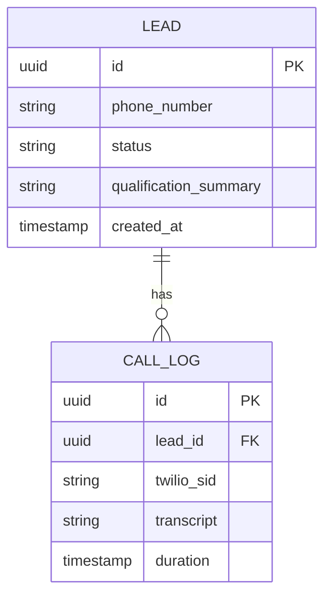

# Technical Architecture - OpenLead AI Dialler

## 1. Architecture Design
```mermaid
graph TD
    subgraph "Frontend (React)"
        "UI Components" --> "Zustand Store"
        "Zustand Store" --> "API Client"
    end

    subgraph "Backend (Express/Fastify)"
        "API Endpoints" --> "Call Service"
        "WebSocket Handler" --> "Media Stream Proxy"
        "Media Stream Proxy" <--> "OpenAI Realtime API"
    end

    subgraph "Data & External"
        "API Endpoints" --> "Supabase (DB/Auth)"
        "Call Service" --> "Twilio API"
        "Media Stream Proxy" <--> "Twilio Media Streams"
    end
```

## 2. Technology Description
- **Frontend**: React@18 + TailwindCSS@3 + Vite
- **Backend**: Node.js + Express/Fastify (supporting WebSockets)
- **State Management**: Zustand
- **Database**: Supabase (PostgreSQL)
- **Real-time Audio**: Twilio Media Streams + OpenAI Realtime API (WebSocket)
- **UI Components**: Radix UI + Lucide React + Framer Motion (for premium animations)

## 3. Route Definitions
| Route | Purpose |
|-------|---------|
| `/` | Dashboard / Analytics |
| `/leads` | Lead management and upload |
| `/settings` | AI Persona and Twilio configuration |
| `/api/calls/start` | Trigger an outbound call |
| `/api/media-stream` | WebSocket endpoint for Twilio audio |

## 4. API Definitions
### 4.1 Start Call
- **Endpoint**: `POST /api/calls/start`
- **Request Body**:
  ```typescript
  {
    leadId: string,
    phoneNumber: string
  }
  ```
- **Response**:
  ```typescript
  {
    success: boolean,
    callSid: string
  }
  ```

## 5. Server Architecture Diagram
```mermaid
graph LR
    "HTTP Controller" --> "Call Service"
    "Call Service" --> "Twilio Client"
    "WS Handler" --> "OpenAI Manager"
    "OpenAI Manager" <--> "OpenAI Realtime WebSocket"
```

## 6. Data Model
### 6.1 Data Model Definition


### 6.2 Data Definition Language
```sql
CREATE TABLE leads (
    id UUID PRIMARY KEY DEFAULT uuid_generate_v4(),
    phone_number TEXT NOT NULL,
    status TEXT DEFAULT 'pending', -- pending, calling, qualified, rejected
    qualification_summary TEXT,
    created_at TIMESTAMP WITH TIME ZONE DEFAULT NOW()
);

CREATE TABLE call_logs (
    id UUID PRIMARY KEY DEFAULT uuid_generate_v4(),
    lead_id UUID REFERENCES leads(id),
    twilio_sid TEXT,
    transcript TEXT,
    created_at TIMESTAMP WITH TIME ZONE DEFAULT NOW()
);
```
